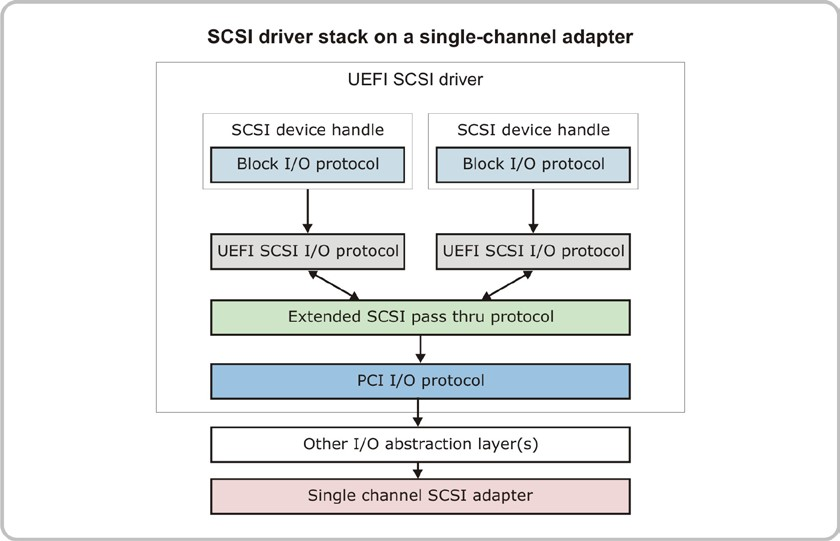

<!--- @file
  20.1.1 Single-Channel SCSI Adapters

  Copyright (c) 2012-2018, Intel Corporation. All rights reserved. 

  Redistribution and use in source (original document form) and 'compiled'
  forms (converted to PDF, epub, HTML and other formats) with or without
  modification, are permitted provided that the following conditions are met:

  1) Redistributions of source code (original document form) must retain the
     above copyright notice, this list of conditions and the following
     disclaimer as the first lines of this file unmodified.

  2) Redistributions in compiled form (transformed to other DTDs, converted to
     PDF, epub, HTML and other formats) must reproduce the above copyright
     notice, this list of conditions and the following disclaimer in the
     documentation and/or other materials provided with the distribution.

  THIS DOCUMENTATION IS PROVIDED BY TIANOCORE PROJECT "AS IS" AND ANY EXPRESS OR
  IMPLIED WARRANTIES, INCLUDING, BUT NOT LIMITED TO, THE IMPLIED WARRANTIES OF
  MERCHANTABILITY AND FITNESS FOR A PARTICULAR PURPOSE ARE DISCLAIMED. IN NO
  EVENT SHALL TIANOCORE PROJECT  BE LIABLE FOR ANY DIRECT, INDIRECT, INCIDENTAL,
  SPECIAL, EXEMPLARY, OR CONSEQUENTIAL DAMAGES (INCLUDING, BUT NOT LIMITED TO,
  PROCUREMENT OF SUBSTITUTE GOODS OR SERVICES; LOSS OF USE, DATA, OR PROFITS;
  OR BUSINESS INTERRUPTION) HOWEVER CAUSED AND ON ANY THEORY OF LIABILITY,
  WHETHER IN CONTRACT, STRICT LIABILITY, OR TORT (INCLUDING NEGLIGENCE OR
  OTHERWISE) ARISING IN ANY WAY OUT OF THE USE OF THIS DOCUMENTATION, EVEN IF
  ADVISED OF THE POSSIBILITY OF SUCH DAMAGE.

-->

### 20.1.1 Single-Channel SCSI Adapters

If the SCSI adapter supports one channel, then the SCSI host controller driver
performs the following:
* Install Extended SCSI Pass Thru Protocol onto the controller handle for the
  SCSI host controller.
* Set the logical attribute for the SCSI channel in the mode structure.
* Set the physical attribute for the SCSI channel in the mode structure.

The following figure shows an example implementation on a single-channel SCSI
adapter. The green layer represents the SCSI host controller driver.

###### Figure 22-Sample SCSI driver stack on single-channel adapter

Because there is only one SCSI channel, the SCSI driver can simply implement
one instance of the Extended SCSI Pass Thru Protocol. The platform firmware
provides the SCSI Bus Driver and SCSI Disk Driver that complete the driver
stack by performing the following actions:
* Scan for SCSI targets on the SCSI channel and create child handles.
* Install Device Path Protocol to each child handle.
* Install SCSI I/O Protocol to each child handle.
* Install I/O abstraction such as the Block I/O Protocol to each child handle.
