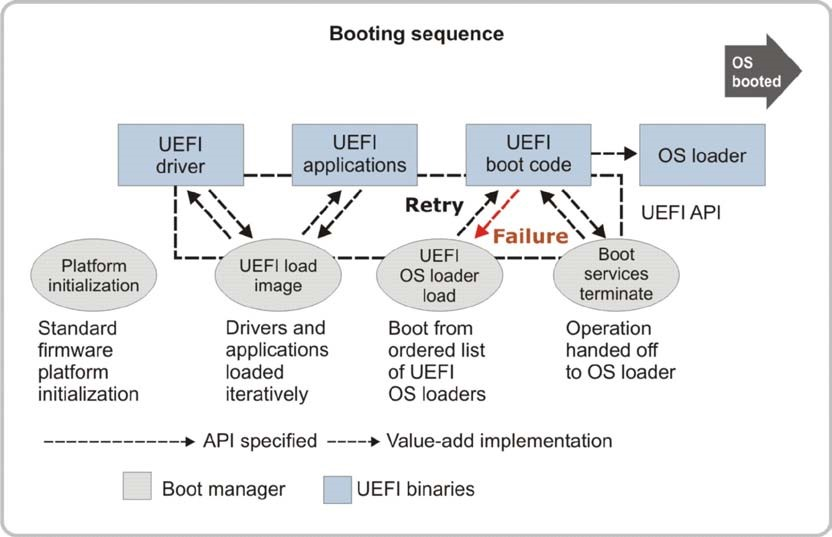

<!--- @file
  3.15 Platform initialization

  Copyright (c) 2012-2018, Intel Corporation. All rights reserved.<BR>

  Redistribution and use in source (original document form) and 'compiled'
  forms (converted to PDF, epub, HTML and other formats) with or without
  modification, are permitted provided that the following conditions are met:

  1) Redistributions of source code (original document form) must retain the
     above copyright notice, this list of conditions and the following
     disclaimer as the first lines of this file unmodified.

  2) Redistributions in compiled form (transformed to other DTDs, converted to
     PDF, epub, HTML and other formats) must reproduce the above copyright
     notice, this list of conditions and the following disclaimer in the
     documentation and/or other materials provided with the distribution.

  THIS DOCUMENTATION IS PROVIDED BY TIANOCORE PROJECT "AS IS" AND ANY EXPRESS OR
  IMPLIED WARRANTIES, INCLUDING, BUT NOT LIMITED TO, THE IMPLIED WARRANTIES OF
  MERCHANTABILITY AND FITNESS FOR A PARTICULAR PURPOSE ARE DISCLAIMED. IN NO
  EVENT SHALL TIANOCORE PROJECT  BE LIABLE FOR ANY DIRECT, INDIRECT, INCIDENTAL,
  SPECIAL, EXEMPLARY, OR CONSEQUENTIAL DAMAGES (INCLUDING, BUT NOT LIMITED TO,
  PROCUREMENT OF SUBSTITUTE GOODS OR SERVICES; LOSS OF USE, DATA, OR PROFITS;
  OR BUSINESS INTERRUPTION) HOWEVER CAUSED AND ON ANY THEORY OF LIABILITY,
  WHETHER IN CONTRACT, STRICT LIABILITY, OR TORT (INCLUDING NEGLIGENCE OR
  OTHERWISE) ARISING IN ANY WAY OUT OF THE USE OF THIS DOCUMENTATION, EVEN IF
  ADVISED OF THE POSSIBILITY OF SUCH DAMAGE.

-->

## 3.15 Platform initialization

Figure 7 shows the sequence of events that occur when a UEFI-based system is
booted. The following sections describe each of these events in detail and how
they relate to UEFI drivers.

###### Figure 7-Booting sequence for UEFI operational model



On the following page, Figure 8 shows a possible system configuration. Each box
represents a physical device (a _controller_) in the system. Before the first
UEFI connection process is performed, none of the devices are registered in the
handle database. The following sections describe the steps that UEFI-conformant
firmware follows to initialize a platform, how drivers are executed, handles
are created, and protocols are installed.

<div style="page-break-after: always;"></div>

###### Figure 8-A sample system configuration


During platform initialization, early in the boot process, the platform creates
handles and install the EBC Protocol and the Decompression Protocol(s) in the
handle database. These service protocols are needed to run UEFI drivers that
may be compressed or compiled using an EBC compiler. The Compression Algorithm
Specification chapter of the _UEFI Specification_ defines the
EFI_DECOMPRESS_PROTOCOL, which defines the standard compression algorithm for
use with UEFI Drivers stored in PCI Option ROMs.

For example, a portion of the handle database as viewed with the `dh` UEFI
Shell command might look like the example below. Handle `6` supports the EBC
Protocol. Handle `9` is an image handle for a UEFI Service Driver. That UEFI
Device Driver installed the EFI_DECOMPRESS_PROTOCOL onto a new handle. The
handle created is handle `A`.

```
...
6: Ebc
...
9: Image(Decompress)
A: Decompress
```
