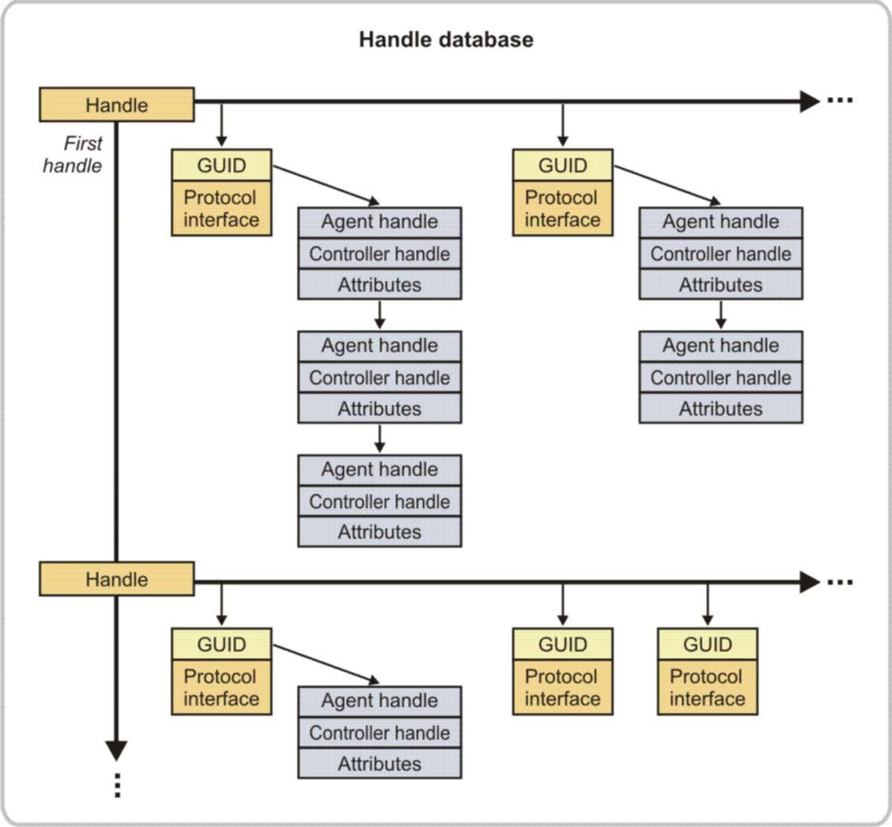
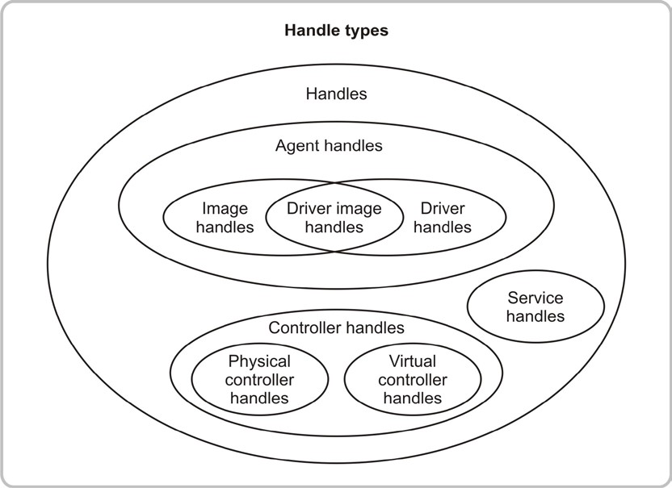

<!--- @file
  3.4 Handle database

  Copyright (c) 2012-2018, Intel Corporation. All rights reserved. 

  Redistribution and use in source (original document form) and 'compiled'
  forms (converted to PDF, epub, HTML and other formats) with or without
  modification, are permitted provided that the following conditions are met:

  1) Redistributions of source code (original document form) must retain the
     above copyright notice, this list of conditions and the following
     disclaimer as the first lines of this file unmodified.

  2) Redistributions in compiled form (transformed to other DTDs, converted to
     PDF, epub, HTML and other formats) must reproduce the above copyright
     notice, this list of conditions and the following disclaimer in the
     documentation and/or other materials provided with the distribution.

  THIS DOCUMENTATION IS PROVIDED BY TIANOCORE PROJECT "AS IS" AND ANY EXPRESS OR
  IMPLIED WARRANTIES, INCLUDING, BUT NOT LIMITED TO, THE IMPLIED WARRANTIES OF
  MERCHANTABILITY AND FITNESS FOR A PARTICULAR PURPOSE ARE DISCLAIMED. IN NO
  EVENT SHALL TIANOCORE PROJECT  BE LIABLE FOR ANY DIRECT, INDIRECT, INCIDENTAL,
  SPECIAL, EXEMPLARY, OR CONSEQUENTIAL DAMAGES (INCLUDING, BUT NOT LIMITED TO,
  PROCUREMENT OF SUBSTITUTE GOODS OR SERVICES; LOSS OF USE, DATA, OR PROFITS;
  OR BUSINESS INTERRUPTION) HOWEVER CAUSED AND ON ANY THEORY OF LIABILITY,
  WHETHER IN CONTRACT, STRICT LIABILITY, OR TORT (INCLUDING NEGLIGENCE OR
  OTHERWISE) ARISING IN ANY WAY OUT OF THE USE OF THIS DOCUMENTATION, EVEN IF
  ADVISED OF THE POSSIBILITY OF SUCH DAMAGE.

-->

## 3.4 Handle database

The handle database is composed of objects called handles and protocols.
_Handles_ are a collection of one or more protocols and _protocols_ are data
structures named by a GUID. The data structure for a protocol may contain data
fields, services, both or none at all.

At reset, the Handle Database is empty. During platform initialization, the
system firmware, UEFI conformant drivers and UEFI applications create handles
and attach one or more protocols to the handles. Information in the handle
database is "global" and accessible by any executable UEFI image.

The handle database is a list of UEFI handles and is the central repository for
the objects maintained by UEFI-based firmware. Each UEFI handle identified by a
unique handle number is maintained by the system firmware. A handle number
provides a database "key" to an entry in the handle database. Each entry in the
handle database is a collection of one or more protocols. The types of
protocols named by a GUID attach to a UEFI handle and determine the handle
type. A UEFI handle may represent components like:

* Executable images such as UEFI drivers and UEFI applications

* Devices such as network controllers and hard drive partitions

* UEFI services which are accessed as drivers such as EFI Decompress and the
  EBC Interpreter

The following figure shows a portion of the handle database. In addition to
the handles and protocols, a list of objects is associated with each protocol.
The handle database uses this list to track which agents are consuming which
protocols. This information is critical to the operation of UEFI drivers. It is
what allows UEFI drivers to be safely loaded, started, stopped and unloaded
without resource conflicts.

###### Figure 2-Handle database

The figure for Handle types, below, shows the different types of handles that may be
present in the handle database and the relationships between the various handle
types. The handle-related terms introduced here appear throughout the document.

There is only one handle database and all handles reside in it. Services that
manage the Handle database do not distinguish handle types. Handles are
differentiated by the types of protocols associated with each handle.

###### Figure 3-Handle types

The following table describes the types of handles shown above. The _UEFI
Specification_ provides detailed information on these types of handles, the
protocols they support, and the different driver types. Note that HII handles
are considered service handles.

###### Table 5-Description of handle types

| **Type of handle**         | **Description**                                                              |
| -------------------------- | ---------------------------------------------------------------------------- |
| Image handle               | This is the handle for the UEFI Driver image loaded into memory. It supports the Loaded Image Protocol.       |
| Driver handle              | Supports all UEFI protocols. The most common protocols are the Driver Binding Protocol, the two Component Name Protocols and the two Driver Diagnostics Protocols.          |
| Driver image handle        | This is a handle that has the attributes of both an Image Handle and a Driver Handle. It is the handle for a UEFI Driver image loaded into memory. It supports the Loaded Image Protocol, and it supports the UEFI Driver related protocols.    |
| Agent handle               | Some of the UEFI driver model-related services in the _UEFI Specification_ use this term. An _agent_ is a UEFI component that can consume a protocol in the handle database. An _agent handle_ is a general term that can represent an image handle, a driver handle or a driver image handle.      |
| Controller handle          | A controller handle represents a console or boot device that is present in the platform. If the handle represents a physical device, then it must support the Device Path Protocol. If the handle represents a virtual device, then it must _not_ support the Device Path Protocol. In addition, a device handle must support one or more additional I/O protocols that are used to abstract access to that device. The list of I/O protocols that are defined in the _UEFI Specification_ include the following:    `Console Services:` These have been replaced or supplemented by HII functionality. These protocols include the Simple Input Protocol, Simple Text Output Protocol, Simple Pointer Protocol, Serial I/O Protocol and Debug Port Protocol.    `Bootable Image Services:` Block I/O Protocol, Disk I/O Protocol, Simple File System Protocol and Load File Protocol.    `Network Services:` Network Interface Identifier Protocol, Simple Network Protocol and PXE Base Code Protocol.    `PCI Services:` PCI Root Bridge I/O Protocol and PCI I/O Protocol.     `USB Services:` USB Host Controller Protocol and USB I/O Protocol.    `SCSI Services:` Extended SCSI Pass Thru Protocol and SCSI I/O Protocol.     `Graphics Services:` Graphics Output Protocol.   |
| Device handle              | Used interchangeably with _controller handle_.    |
| Bus controller handle      | A Controller Handle managed by a bus driver or a hybrid driver-producing child handles. The term "bus" does not necessarily match the hardware topology. The term "bus" in this document is used from the software perspective and the production of the software construct-a child handle-is the only distinction between a controller handle and a bus controller handle.       |
| Child handle               | This is a Controller Handle created by a bus driver or a hybrid driver. The distinction between a child handle and a controller handle depends on the perspective of the driver that is using the handle. A handle would be a child handle from a bus driver's perspective, and that same handle may be a controller handle from a device driver's perspective.        |
| Physical controller handle | A controller handle representing a physical device that must support the Device Path Protocol. See the _UEFI Specification._         |
| Virtual controller handle  | A controller handle representing a virtual device and not supporting the Device Path Protocol.   |
| Service handle             | A handle referencing certain types of tasks such as decompression or HII forms display. It can interface with other drivers, but does not relate to hardware or file management. This type of handle is not used for the Loaded Image Protocol, the Driver Binding Protocol or the Device Path Protocol. Instead, this type of handle supports the only instance of a specific protocol in the entire handle database. This protocol provides services that may be used by other UEFI applications or UEFI drivers. The list of service protocols that are defined in the _UEFI Specification_ include:    HII functionality     Platform Driver Override Protocol     Unicode Collation Protocol    Boot Integrity Services Protocol    Debug Support Protocols    Decompress Protocol (optional). To give developers more flexibility, the EDK II open source project provides several decompression algorithms    EFI Byte Code (EBC) Protocol  |
