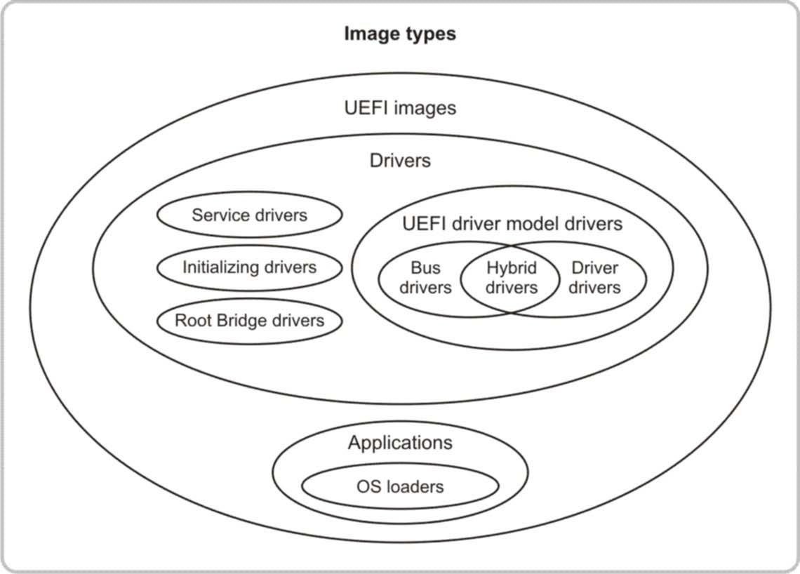

<!--- @file
  3.7 UEFI images

  Copyright (c) 2012-2018, Intel Corporation. All rights reserved. 

  Redistribution and use in source (original document form) and 'compiled'
  forms (converted to PDF, epub, HTML and other formats) with or without
  modification, are permitted provided that the following conditions are met:

  1) Redistributions of source code (original document form) must retain the
     above copyright notice, this list of conditions and the following
     disclaimer as the first lines of this file unmodified.

  2) Redistributions in compiled form (transformed to other DTDs, converted to
     PDF, epub, HTML and other formats) must reproduce the above copyright
     notice, this list of conditions and the following disclaimer in the
     documentation and/or other materials provided with the distribution.

  THIS DOCUMENTATION IS PROVIDED BY TIANOCORE PROJECT "AS IS" AND ANY EXPRESS OR
  IMPLIED WARRANTIES, INCLUDING, BUT NOT LIMITED TO, THE IMPLIED WARRANTIES OF
  MERCHANTABILITY AND FITNESS FOR A PARTICULAR PURPOSE ARE DISCLAIMED. IN NO
  EVENT SHALL TIANOCORE PROJECT  BE LIABLE FOR ANY DIRECT, INDIRECT, INCIDENTAL,
  SPECIAL, EXEMPLARY, OR CONSEQUENTIAL DAMAGES (INCLUDING, BUT NOT LIMITED TO,
  PROCUREMENT OF SUBSTITUTE GOODS OR SERVICES; LOSS OF USE, DATA, OR PROFITS;
  OR BUSINESS INTERRUPTION) HOWEVER CAUSED AND ON ANY THEORY OF LIABILITY,
  WHETHER IN CONTRACT, STRICT LIABILITY, OR TORT (INCLUDING NEGLIGENCE OR
  OTHERWISE) ARISING IN ANY WAY OUT OF THE USE OF THIS DOCUMENTATION, EVEN IF
  ADVISED OF THE POSSIBILITY OF SUCH DAMAGE.

-->

## 3.7 UEFI images

There are different types of UEFI images, but all UEFI images contain a PE/COFF
header that defines the format of the executable code. The PE/COFF image header
follows the format defined by the _Microsoft Portable Executable and Common
Object File Format Specification_. The code can be for IA32, X64, IPF, or EBC.
The header defines the processor type and the image type. Refer to the UEFI
Image section of the Overview chapter in the _UEFI Specification_ for
definitions of the processor types and the following three image types:

* UEFI applications

* UEFI boot services drivers

* UEFI runtime drivers

UEFI images are loaded and relocated into memory with the boot service
`LoadImage()`.

There are several supported storage locations for UEFI images, including:

* Expansion ROMs on a PCI card

* System ROM or system flash

* A media device such as a hard disk, floppy, CD-ROM, DVD, FLASH drive

* LAN server

In general, UEFI images are not compiled and linked at a specific address.
Instead, they are compiled and linked such that relocation fix-ups are included
in the UEFI image. This allows the UEFI image to be placed anywhere in system
memory. The Boot Service `LoadImage()` does the following:

* Allocates memory for the image being loaded

* Automatically applies the relocation fix-ups to the image

* Creates a new image handle in the handle database, which installs an instance
  of the `EFI_LOADED_IMAGE_PROTOCOL`

This instance of the `EFI_LOADED_IMAGE_PROTOCOL` contains information about the
UEFI image that was loaded. Because this information is published in the handle
database, it is available to all UEFI components.

After a UEFI image is loaded with `LoadImage()`, the image can be started with
a call to `StartImage()`. The header for a UEFI image contains the address of
the entry point called by `StartImage()`. The entry point always receives the
following two parameters:

* The image handle of the UEFI image being started

* A pointer to the UEFI system table

The image handle and pointer allow the UEFI image to:

* Access all of the UEFI services that are available in the platform.

* Retrieve information about where the UEFI image was loaded from and where in
  memory the image was placed.

The operations performed by the UEFI image in its entry point vary depending on
the type of UEFI image. The figure below shows the various UEFI image types and
the relationships between the different levels of images.

###### Figure 5-Image types

The table below describes the types of images shown in the preceding figure.

###### Table 6-Description of image types

| **Type of image**        | **Description**                                                                      |
| ------------------------ | ------------------------------------------------------------------------------------ |
| Application              | A UEFI image of type `EFI`_`IMAGE`_`SUBSYSTEM`_`EFI`_`APPLICATION`. This image is executed and automatically unloaded when the image exits or returns from its entry point.       |
| OS loader                | A special type of application that normally does not return or exit. Instead, it calls the EFI Boot Service `ExitBootServices()` to transfer control of the platform from the firmware to an operating system.       |
| Driver                   | A UEFI image of type `EFI`_`IMAGE`_`SUBSYSTEM`_`BOOT`_`SERVICE`_`DRIVER` or `EFI`_`IMAGE`_`SUBSYSTEM`_`RUNTIME`_`DRIVER`. If this image returns `EFI`_`SUCCESS`, then the image is not unloaded. If the image returns an error code other than `EFI`_`SUCCESS`, then the image is automatically unloaded from system memory. The ability to stay resident in system memory is what differentiates a driver from an application. Because drivers can stay resident in memory, they can provide services to other drivers, applications, or an operating system. Only the services produced by runtime drivers are allowed to persist past `ExitBootServices()`.   |
| Service driver           | A driver that produces one or more protocols on one or more new service handles and returns `EFI_SUCCESS` from its entry point.    |
| Initializing driver      | A driver that does not create any handles and does not add any protocols to the handle database. Instead, this type of driver performs some initialization operations and returns an error code so the driver is unloaded from system memory.      |
| Root bridge driver       | A driver that creates one or physical controller handles that contain a Device Path Protocol and a protocol that is a software abstraction for the I/O services provided by a root bus produced by a core chipset. The most common root bridge driver is one that creates handles for the PCI root bridges in the platform that support the Device Path Protocol and the PCI Root Bridge I/O Protocol.         |
| UEFI driver model driver | A driver that follows the UEFI driver model described in the UEFI Driver Model chapter of the _UEFI Specification_. This type of driver is fundamentally different from service drivers, initializing drivers, and root bridge drivers because a driver that follows the UEFI driver model is not allowed to touch hardware or produce device-related services in the driver entry point. Instead, the driver entry point of a driver that follows the UEFI driver model is allowed only to register a set of services that allow the driver to be started and stopped at a later point in the system initialization process. |
| Device driver            | A driver following the UEFI driver model. This type of driver produces one or more driver handles or driver image handles by installing one or more instances of the Driver Binding Protocol into the handle database. This type of driver does not create any child handles when the `Start()` service of the Driver Binding Protocol is called. Instead, it only adds additional I/O protocols to existing controller handles.          |
| Bus driver               | A driver following the UEFI driver model. This type of driver produces one or more driver handles or driver image handles by installing one or more instances of the Driver Binding Protocol in the handle database. This type of driver creates new child handles when the `Start()` service of the Driver Binding Protocol is called. It also adds I/O protocols to these newly created child handles.           |
| Hybrid driver            | A driver that follows the UEFI driver model and shares characteristics with both device drivers and bus drivers. This distinction means that the `Start()` service of the Driver Binding Protocol adds I/O protocols to existing handles and creates child handles.     |
