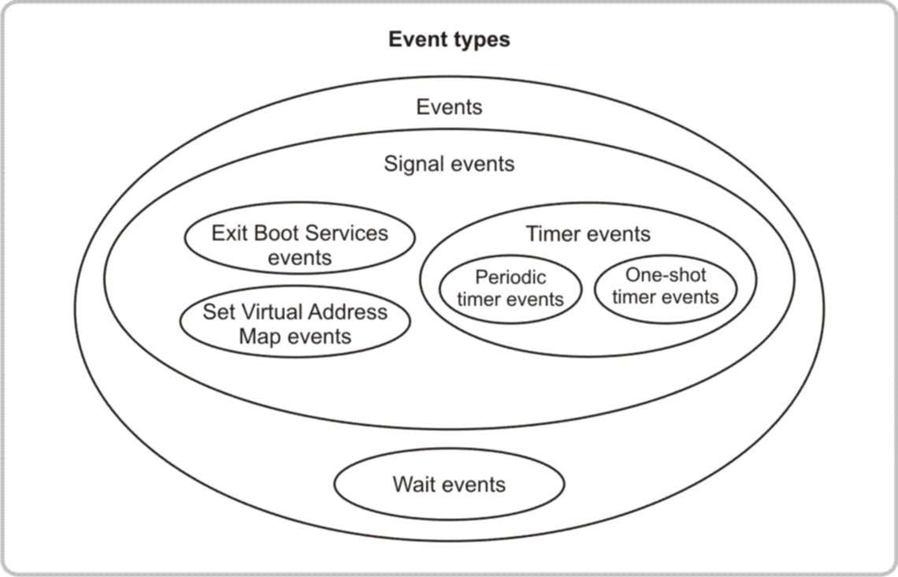

<!--- @file
  3.8 Events and task priority levels

  Copyright (c) 2012-2018, Intel Corporation. All rights reserved. 

  Redistribution and use in source (original document form) and 'compiled'
  forms (converted to PDF, epub, HTML and other formats) with or without
  modification, are permitted provided that the following conditions are met:

  1) Redistributions of source code (original document form) must retain the
     above copyright notice, this list of conditions and the following
     disclaimer as the first lines of this file unmodified.

  2) Redistributions in compiled form (transformed to other DTDs, converted to
     PDF, epub, HTML and other formats) must reproduce the above copyright
     notice, this list of conditions and the following disclaimer in the
     documentation and/or other materials provided with the distribution.

  THIS DOCUMENTATION IS PROVIDED BY TIANOCORE PROJECT "AS IS" AND ANY EXPRESS OR
  IMPLIED WARRANTIES, INCLUDING, BUT NOT LIMITED TO, THE IMPLIED WARRANTIES OF
  MERCHANTABILITY AND FITNESS FOR A PARTICULAR PURPOSE ARE DISCLAIMED. IN NO
  EVENT SHALL TIANOCORE PROJECT  BE LIABLE FOR ANY DIRECT, INDIRECT, INCIDENTAL,
  SPECIAL, EXEMPLARY, OR CONSEQUENTIAL DAMAGES (INCLUDING, BUT NOT LIMITED TO,
  PROCUREMENT OF SUBSTITUTE GOODS OR SERVICES; LOSS OF USE, DATA, OR PROFITS;
  OR BUSINESS INTERRUPTION) HOWEVER CAUSED AND ON ANY THEORY OF LIABILITY,
  WHETHER IN CONTRACT, STRICT LIABILITY, OR TORT (INCLUDING NEGLIGENCE OR
  OTHERWISE) ARISING IN ANY WAY OUT OF THE USE OF THIS DOCUMENTATION, EVEN IF
  ADVISED OF THE POSSIBILITY OF SUCH DAMAGE.

-->

## 3.8 Events and task priority levels

Events are another type of object that is managed through UEFI services. They
provide synchronous or asynchronous call back upon a particular occurrence.
They can be created and destroyed and are either in the waiting state or the
signaled state. A UEFI image can do any of the following:

* Create an event.

* Destroy an event.

* Check to see if an event is in the signaled state.

* Wait for an event to be in the signaled state.

* Request that an event be moved from the waiting state to the signaled state.

`UEFI supports polled drivers, not interrupts.` Because UEFI does not support
interrupts, it can present a challenge to driver writers who are used to an
interruptdriven driver model.

The most common use of events by a UEFI driver is the use of timer events that
allow drivers to poll a device periodically. The figure below shows the
different types of events supported in UEFI, as well as the relationships
between those events.

###### Figure 6-Event types

The following table describes the types of events shown in the preceding figure.

###### Table 7-Description of event types

| **Type of events**            | **Description**                                                                                      |
| ----------------------------- | ---------------------------------------------------------------------------------------------------- |
| Wait event                    | An event whose notification function is executed whenever the event is checked or waited upon.       |
| Signal event                  | An event whose notification function is scheduled for execution whenever the event goes from the waiting state to the signaled state.   |
| Exit Boot Services event      | A special type of signal event that is moved from the waiting state to the signaled state when the EFI Boot Service `ExitBootServices()` is called. This call is the point in time when ownership of the platform is transferred from the firmware to an operating system. The event's notification function is scheduled for execution when `ExitBootServices()` is called.   |
| Set Virtual Address Map event | A special type of signal event that is moved from the waiting state to the signaled state when the UEFI runtime service `SetVirtualAddressMap()` is called. This call is the point in time when the operating system is making a request for the runtime components of UEFI to be converted from a physical addressing mode to a virtual addressing mode. The operating system provides the map of virtual addresses to use. The event's notification function is scheduled for execution when `SetVirtualAddressMap()` is called. |
| Timer event                   | A type of signal event that is moved from the waiting state to the signaled state when at least a specified amount of time has elapsed. Both periodic and one-shot timers are supported. The event's notification function is scheduled for execution when a specific amount of time has elapsed.     |
| Periodic timer event          | A type of timer event that is moved from the waiting state to the signaled state at a specified frequency. The event's notification function is scheduled for execution when a specific amount of time has elapsed.    |
| One-shot timer event          | A type of timer event that is moved from the waiting state to the signaled state after the specified time period has elapsed. The event's notification function is scheduled for execution when a specific amount of time has elapsed.

The following three elements are associated with every event:

* The task priority level (TPL) of the event

* A notification function

* A notification context

The notification function for a wait event is executed when the state of the
event is checked or when the event is being waited upon. The notification
function of a signal event is executed whenever the event transitions from the
waiting state to the signaled state.

The notification context is passed into the notification function each time the
notification function is executed. The TPL is the priority at which the
notification function is executed. The four TPL levels that are defined in UEFI
are listed in the table below.

###### Table 8-Task priority levels defined in UEFI

| **Task Priority Level** | **Description**                                                                            |
| ----------------------- | ------------------------------------------------------------------------------------------ |
| `TPL_APPLICATION`       | The priority level at which UEFI images are executed.                                      |
| `TPL_CALLBACK`          | The priority level for most notification functions.                                        |
| `TPL_NOTIFY`            | The priority level at which most I/O operations are performed.                             |
| `TPL_HIGH_LEVEL`        | The priority level for the one timer interrupt supported in UEFI. (Not usable by drivers)  |

TPLs serve two purposes:

* Define the priority in which notification functions are executed

* Create locks
