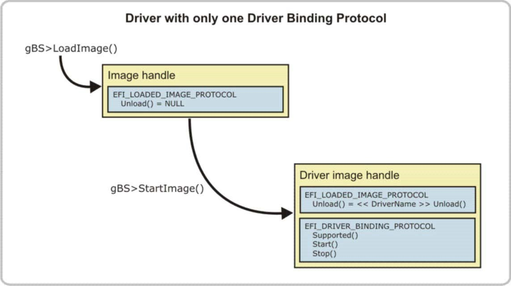

<!--- @file
  6.1.4 Device drivers with one driver binding protocol

  Copyright (c) 2012-2018, Intel Corporation. All rights reserved. 

  Redistribution and use in source (original document form) and 'compiled'
  forms (converted to PDF, epub, HTML and other formats) with or without
  modification, are permitted provided that the following conditions are met:

  1) Redistributions of source code (original document form) must retain the
     above copyright notice, this list of conditions and the following
     disclaimer as the first lines of this file unmodified.

  2) Redistributions in compiled form (transformed to other DTDs, converted to
     PDF, epub, HTML and other formats) must reproduce the above copyright
     notice, this list of conditions and the following disclaimer in the
     documentation and/or other materials provided with the distribution.

  THIS DOCUMENTATION IS PROVIDED BY TIANOCORE PROJECT "AS IS" AND ANY EXPRESS OR
  IMPLIED WARRANTIES, INCLUDING, BUT NOT LIMITED TO, THE IMPLIED WARRANTIES OF
  MERCHANTABILITY AND FITNESS FOR A PARTICULAR PURPOSE ARE DISCLAIMED. IN NO
  EVENT SHALL TIANOCORE PROJECT  BE LIABLE FOR ANY DIRECT, INDIRECT, INCIDENTAL,
  SPECIAL, EXEMPLARY, OR CONSEQUENTIAL DAMAGES (INCLUDING, BUT NOT LIMITED TO,
  PROCUREMENT OF SUBSTITUTE GOODS OR SERVICES; LOSS OF USE, DATA, OR PROFITS;
  OR BUSINESS INTERRUPTION) HOWEVER CAUSED AND ON ANY THEORY OF LIABILITY,
  WHETHER IN CONTRACT, STRICT LIABILITY, OR TORT (INCLUDING NEGLIGENCE OR
  OTHERWISE) ARISING IN ANY WAY OUT OF THE USE OF THIS DOCUMENTATION, EVEN IF
  ADVISED OF THE POSSIBILITY OF SUCH DAMAGE.

-->

### 6.1.4 Device drivers with one driver binding protocol

Most device drivers produce a single instance of the
`EFI_DRIVER_BINDING_PROTOCOL`. These drivers are the simplest among those that follow the UEFI driver model
and all other driver types have their roots in this type of device driver.

A device driver is loaded into memory with the `LoadImage()` Boot Service and
invoked with the `StartImage()` Boot Service. The `LoadImage()` service
automatically creates an image handle and installs the
`EFI_LOADED_IMAGE_PROTOCOL` onto the image handle. The
`EFI_LOADED_IMAGE_PROTOCOL` describes the location from where the device driver
was loaded and the location in system memory to where the device driver was
placed. The `Unload()` service of the `EFI_LOADED_IMAGE_PROTOCOL` is
initialized to `NULL` by `LoadImage()`. This setting means that by default the
driver does not have an unload function.

The `StartImage()` service transfers control to the driver's entry point as
described in the PE/COFF header of the UEFI Driver image. The PE/COFF header layout is defined
in the _Microsoft Portable Executable and Common Object File Format
Specification._

The driver entry point is responsible for installing the Driver Binding
Protocol onto the driver's image handle. The figure below shows the state of
the system before a device driver is loaded, just before it is started, and
after the driver's entry point has been executed.

###### Figure 9-Device driver with single Driver Binding Protocol

The following figure is the same as the figure above, except this device
driver has also implemented optional features. This difference means the
following:

* Additional protocols are installed onto the driver's image handle.

* An `Unload()` service is registered in the `EFI_LOADED_IMAGE_PROTOCOL`.

* An Exit Boot Services event and Set Virtual Address Map event have been
  created. These are part of the driver's initialization (the driver's entry
  point).

###### Figure 10-Device driver with optional features

