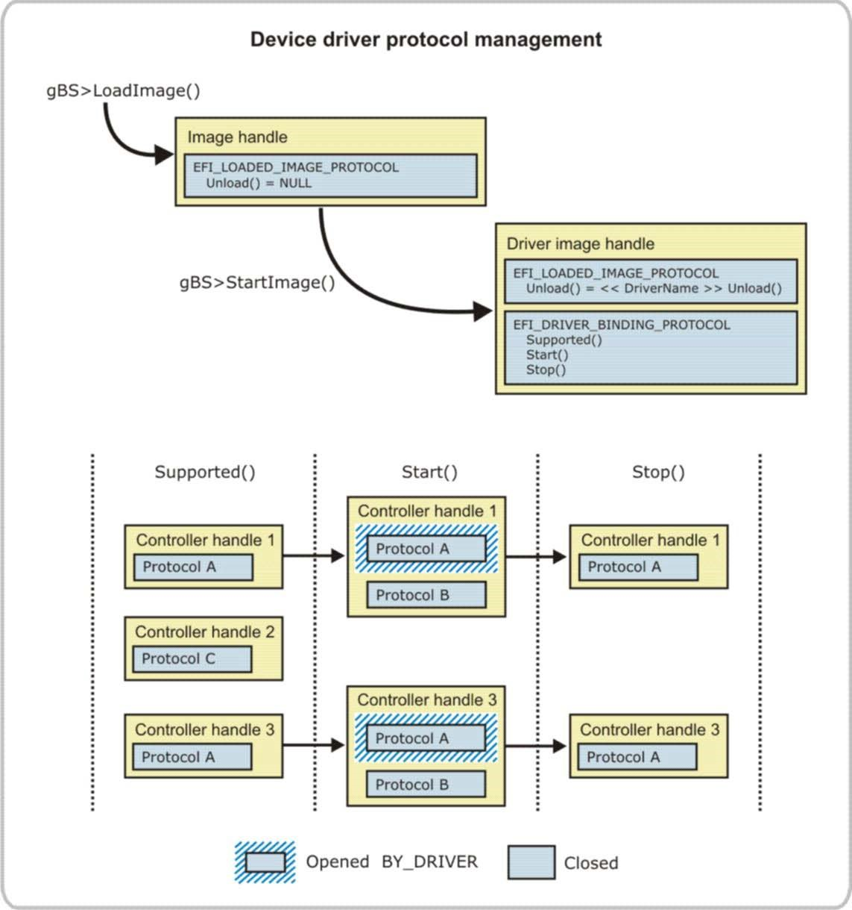
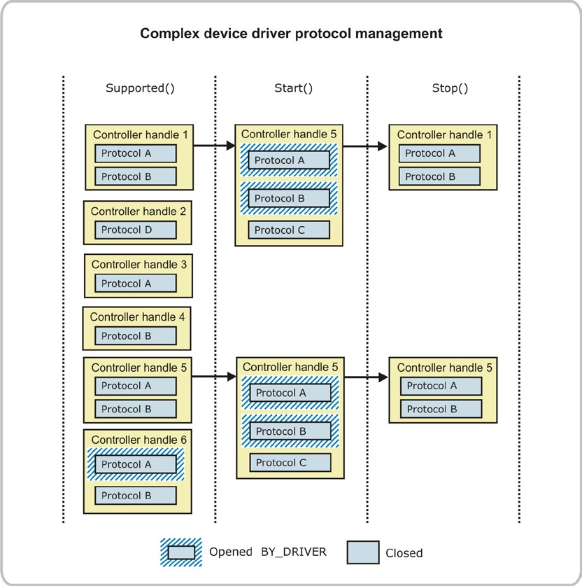

<!--- @file
  6.1.6 Device driver protocol management

  Copyright (c) 2012-2018, Intel Corporation. All rights reserved. 

  Redistribution and use in source (original document form) and 'compiled'
  forms (converted to PDF, epub, HTML and other formats) with or without
  modification, are permitted provided that the following conditions are met:

  1) Redistributions of source code (original document form) must retain the
     above copyright notice, this list of conditions and the following
     disclaimer as the first lines of this file unmodified.

  2) Redistributions in compiled form (transformed to other DTDs, converted to
     PDF, epub, HTML and other formats) must reproduce the above copyright
     notice, this list of conditions and the following disclaimer in the
     documentation and/or other materials provided with the distribution.

  THIS DOCUMENTATION IS PROVIDED BY TIANOCORE PROJECT "AS IS" AND ANY EXPRESS OR
  IMPLIED WARRANTIES, INCLUDING, BUT NOT LIMITED TO, THE IMPLIED WARRANTIES OF
  MERCHANTABILITY AND FITNESS FOR A PARTICULAR PURPOSE ARE DISCLAIMED. IN NO
  EVENT SHALL TIANOCORE PROJECT  BE LIABLE FOR ANY DIRECT, INDIRECT, INCIDENTAL,
  SPECIAL, EXEMPLARY, OR CONSEQUENTIAL DAMAGES (INCLUDING, BUT NOT LIMITED TO,
  PROCUREMENT OF SUBSTITUTE GOODS OR SERVICES; LOSS OF USE, DATA, OR PROFITS;
  OR BUSINESS INTERRUPTION) HOWEVER CAUSED AND ON ANY THEORY OF LIABILITY,
  WHETHER IN CONTRACT, STRICT LIABILITY, OR TORT (INCLUDING NEGLIGENCE OR
  OTHERWISE) ARISING IN ANY WAY OUT OF THE USE OF THIS DOCUMENTATION, EVEN IF
  ADVISED OF THE POSSIBILITY OF SUCH DAMAGE.

-->

### 6.1.6 Device driver protocol management

Device drivers consume one or more I/O-related protocols and use the services
of those protocols to produce one or more I/O-related protocols. The
`Supported()` and `Start()` functions of the Driver Binding Protocol are
responsible for opening the I/Orelated protocols being consumed using the EFI
Boot Service `OpenProtocol()`. The `Stop()` function is responsible for closing
the consumed I/O-related protocols using `CloseProtocol()`.

A protocol can be opened in several different modes, but the most common is
`EFI_OPEN_PROTOCOL_BY_DRIVER`. When a protocol is opened by
`EFI_OPEN_PROTOCOL_BY_DRIVER`, a test is made to see if that protocol is
already being consumed by any other drivers. The open operation succeeds only
if the protocol is not being consumed by any other drivers.

**********
**Caution:** Using the `OpenProtocol()` service with
**EFIOPEN_PROTOCOL_BY_DRIVER** is how resource conflicts are avoided in the
UEFI driver model. However, it requires that every driver present in the system
follow the driver interoperability rules for all resource conflicts to be
avoided._
**********

The following figure shows the image handle for a device driver as
`LoadImage()` and `StartImage()` are called. In addition, it shows the states
of three different controller handles as the Driver Binding Protocol services
`Supported()`, `Start()`, and `Stop()` are called. `Controller Handle 1` and
`Controller Handle 3` pass the `Supported()` test, so the `Start()` function
can be called. In this case, the `Supported()` service tests to see if the
controller handle supports Protocol A. `Start()` is then called for `Controller Handle 1` and `Controller Handle 3`. In the `Start()` function, `Protocol A` is opened `EFI_OPEN_PROTOCOL_BY_DRIVER`, and `Protocol B` is installed onto the same controller handle. The implementation of `Protocol B` uses the services of `Protocol A` to produce the services of `Protocol B`.

All drivers that follow the UEFI driver model must support the `Stop()`
service. The `Stop()` service must put the handles back into their previous
state, before `Start()` was called, so the `Stop()` service uninstalls
`Protocol B` and closes `Protocol A`.

###### Figure 12-Device driver protocol management

The figure below shows a more complex device driver that requires `Protocol A` and `Protocol B` to produce `Protocol C`. Notice that the controller handles that do not support _either_ `Protocol A` or `Protocol B` do not pass the `Supported()` test. In addition, controller handles that _only_ support `Protocol A` or only `Protocol B` also do not pass the `Supported()` test. Finally, note that `Controller Handle 6` already has `Protocol A` opened by `EFI_OPEN_PROTOCOL_BY_DRIVER`, so this device driver requiring both `Protocol A` and `Protocol B` also does not pass the `Supported()` test.

This example highlights some of the flexibility of the UEFI driver model.
Because the `Supported()` and `Start()` services are functions, a driver writer
can implement simple or complex algorithms to test driver support for a
specific controller handle.

###### Figure 13-Complex device driver protocol management

**********
**TIP:** The best way to design the algorithm for the opening protocols is to
write a Boolean expression for the protocols that a device driver consumes.
Then, expand this Boolean expression into the sum of products form. Each
product in the expanded expression requires its own Driver Binding Protocol.
**********

This scenario is another way that a device driver may be required to produce
multiple instances of the Driver Binding Protocol. The `Supported()` service
for each Driver Binding Protocol attempts to open each protocol in a product
term. If any of those open operations fail, then `Supported()` fails. If all
the opens succeed, then the `Supported()` test passes. The `Start()` function
should open each protocol in the product term, and the `Stop()` function should
close each protocol in the product term.

For example, the two examples above would have the following Boolean expressions:

* (`Protocol A`)

* (`Protocol A` AND `Protocol B`)

These two expressions have only one product term, so only one `EFI_DRIVER_BINDING_PROTOCOL` is required. A more complex expression would be
as follows:

* (`Protocol A` AND (`Protocol B` OR `Protocol C`))

If this Boolean expression is expanded into a sum of product form, it would
yield the following:

* ((`Protocol A` AND `Protocol C`) OR (`Protocol B` AND `Protocol C`))

This expression would require a driver with two instances of the `EFI_DRIVER_BINDING_PROTOCOL`. One would test for `Protocol A` and `Protocol C`, and the other would test for `Protocol B` and `Protocol C`
