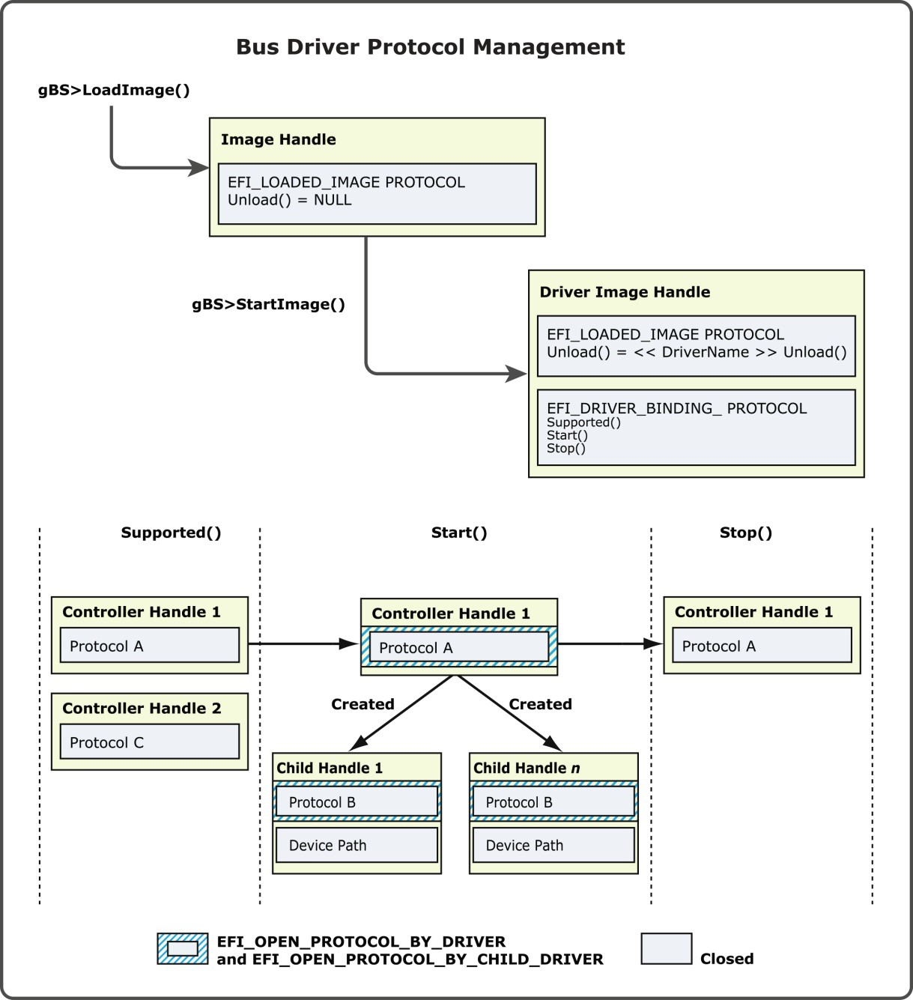

<!--- @file
  6.2.5 Bus driver protocol and child management

  Copyright (c) 2012-2018, Intel Corporation. All rights reserved. 

  Redistribution and use in source (original document form) and 'compiled'
  forms (converted to PDF, epub, HTML and other formats) with or without
  modification, are permitted provided that the following conditions are met:

  1) Redistributions of source code (original document form) must retain the
     above copyright notice, this list of conditions and the following
     disclaimer as the first lines of this file unmodified.

  2) Redistributions in compiled form (transformed to other DTDs, converted to
     PDF, epub, HTML and other formats) must reproduce the above copyright
     notice, this list of conditions and the following disclaimer in the
     documentation and/or other materials provided with the distribution.

  THIS DOCUMENTATION IS PROVIDED BY TIANOCORE PROJECT "AS IS" AND ANY EXPRESS OR
  IMPLIED WARRANTIES, INCLUDING, BUT NOT LIMITED TO, THE IMPLIED WARRANTIES OF
  MERCHANTABILITY AND FITNESS FOR A PARTICULAR PURPOSE ARE DISCLAIMED. IN NO
  EVENT SHALL TIANOCORE PROJECT  BE LIABLE FOR ANY DIRECT, INDIRECT, INCIDENTAL,
  SPECIAL, EXEMPLARY, OR CONSEQUENTIAL DAMAGES (INCLUDING, BUT NOT LIMITED TO,
  PROCUREMENT OF SUBSTITUTE GOODS OR SERVICES; LOSS OF USE, DATA, OR PROFITS;
  OR BUSINESS INTERRUPTION) HOWEVER CAUSED AND ON ANY THEORY OF LIABILITY,
  WHETHER IN CONTRACT, STRICT LIABILITY, OR TORT (INCLUDING NEGLIGENCE OR
  OTHERWISE) ARISING IN ANY WAY OUT OF THE USE OF THIS DOCUMENTATION, EVEN IF
  ADVISED OF THE POSSIBILITY OF SUCH DAMAGE.

-->

### 6.2.5 Bus driver protocol and child management

The management of I/O-related protocols by a bus driver is very similar to the
management of I/O-related protocol for device drivers described in _Section
6.1.6_. A bus driver opens one or more I/O-related protocols on the controller
handle for the bus controller, creates one or more child handles and installs
one or more I/O-related protocols. If the child handle represents a physical
device, a Device Path Protocol must also be installed onto the child handle.
The child handle is also required to open the parent I/O protocol with an
attribute of `EFI_OPEN_PROTOCOL_BY_CHILD_CONTROLLER`.

Some types of bus drivers can produce a single child handle each time `Start()`
is called, but only if the _RemainingDevicePath_ passed into `Start()`
represents a valid child device. This distinction means that it may take
multiple calls to `Start()` to produce all the child handles. If
_RemainingDevicePath_ is `NULL`, all remaining child handles are created at
once.

When a bus driver opens an I/O-related protocol on the controller handle, it
typically uses an open mode of `EFI_OPEN_PROTOCOL_BY_DRIVER`. However,
depending on the type of bus driver, a return code of `EFI_ALREADY_STARTED`
from `OpenProtocol()` may be acceptable. If a device driver gets this return
code, then the device driver should not manage the controller handle. If a bus
driver gets this return code, then it means that the bus driver has already
connected to the controller handle.

The figure below shows a simple bus driver that consumes `Protocol A` from a
bus controller handle and creates N child handles with a `Device Path Protocol`
and `Protocol B`. The `Stop()` function is responsible for destroying the child
handles by removing **Protocol B** and the `Device Path Protocol`. `Protocol A` is
first opened `EFI_OPEN_PROTOCOL_BY_DRIVER` so **Protocol A** cannot be requested
by any other drivers. Then, as each child handle is created, the child handle
opens `Protocol A` `EFI_OPEN_PROTOCOL_BY_CHILD_CONTROLLER`. Using this attribute records the
parent-child relationship in the handle database, so this information can be
extracted if needed. The parent-child links are used by
`DisconnectController()` when a request is made to stop a bus controller.

###### Figure 14-Bus driver protocol management

The following sections describe the subtle differences in child handle creation
for each of the bus driver types.
